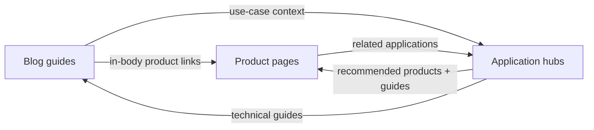

# Internal linking map — Wiberg Metal

Purpose: move authority between **blog (guides)**, **products (commercial intent)**, and **applications (use-case hubs)** so crawlers see a clear triangle: guides cite products, products cite use cases, use cases cite products and guides.

Paths below are **site root–relative** (as on `https://wibergmetal.com/`).

---

## 1. Blog → products (required edges)

Each article should include **in-body** links (not only nav/footer) to at least **two** relevant product URLs (hub or leaf).

| Blog URL | Primary product targets | Suggested anchor text (vary naturally) |
|----------|-------------------------|----------------------------------------|
| `/blog/how-to-choose-steel-grating/` | `/products/bar-grating/welded-bar-grating/`, `/products/bar-grating/serrated-bar-grating/`, `/products/bar-grating/press-locked-bar-grating/`, `/products/bar-grating/heavy-duty-welded-bar-grating/`, `/products/frp-grating/molded-frp-grating/`, `/products/stair-treads/`, `/products/trench-covers/`, `/products/accessories/` | “welded steel bar grating”, “serrated bearing bars”, “press-locked grating”, “heavy-duty welded grating”, “molded FRP grating”, “industrial stair treads”, “trench covers”, “grating accessories” |
| `/blog/steel-grating-load-capacity-explained/` | `/products/bar-grating/welded-bar-grating/`, `/products/bar-grating/heavy-duty-welded-bar-grating/`, `/products/stair-treads/welded-stair-treads/`, `/products/accessories/saddle-clips/` | “welded bar grating”, “heavy-duty welded grating”, “welded stair treads”, “saddle clips” |
| `/blog/steel-grating-for-data-centers/` | `/products/bar-grating/welded-bar-grating/`, `/products/bar-grating/press-locked-bar-grating/`, `/products/bar-grating/serrated-bar-grating/`, `/products/bar-grating/composite-steel-grating/`, `/products/trench-covers/`, `/products/stair-treads/`, `/products/frp-grating/`, `/products/accessories/` | “welded steel bar grating”, “press-locked grating”, “serrated grating”, “composite grating”, “trench covers”, “serrated stair treads”, “FRP grating”, “accessories” |
| `/blog/steel-grating-for-power-plants/` | Same bar-grating family + `/products/stair-treads/welded-stair-treads/`, `/products/stair-treads/serrated-stair-treads/`, `/products/trench-covers/heavy-duty-trench-covers/`, `/products/frp-grating/chemical-resistant-frp-grating/`, `/products/accessories/hold-down-clips/`, `/products/accessories/banding-bars/` | “welded steel bar grating”, “heavy-duty welded grating”, “serrated stair treads”, “heavy-duty trench covers”, “chemical-resistant FRP”, “hold-down clips”, “banding bars” |
| `/blog/anti-slip-stair-treads-guide/` | `/products/stair-treads/`, `/products/stair-treads/serrated-stair-treads/`, `/products/frp-grating/` | “industrial stair treads”, “serrated stair treads”, “FRP grating” |
| `/blog/trench-covers-selection-guide/` | `/products/trench-covers/standard-trench-covers/`, `/products/trench-covers/heavy-duty-trench-covers/`, `/products/trench-covers/drainage-channel-covers/` | “standard trench covers”, “heavy-duty trench covers”, “drainage channel covers” |
| `/blog/frp-vs-steel-grating/` | `/products/bar-grating/welded-bar-grating/`, `/products/bar-grating/press-locked-bar-grating/`, `/products/frp-grating/molded-frp-grating/`, `/products/frp-grating/mini-mesh-frp-grating/`, `/products/frp-grating/chemical-resistant-frp-grating/`, `/products/frp-grating/anti-slip-frp-grating/` | “welded bar grating”, “molded FRP”, “mini-mesh FRP”, “chemical-resistant FRP”, “anti-slip FRP grating” |

**Blog hub** (`/blog/`): one short paragraph linking to the four product families + `/solutions/applications/` is enough to reinforce the graph from the index.

---

## 2. Blog → applications (recommended)

Links from guides to **use-case hubs** clarify intent clustering (informational → topical hubs).

| Blog URL | Application hubs | Suggested anchors |
|----------|------------------|-------------------|
| `/blog/how-to-choose-steel-grating/` | `/solutions/applications/platform-flooring/`, `/solutions/applications/walkways/` | “platform flooring applications”, “industrial walkway applications” |
| `/blog/steel-grating-load-capacity-explained/` | `/solutions/applications/platform-flooring/`, `/solutions/applications/walkways/` | “platform decking”, “walkway grating” |
| `/blog/trench-covers-selection-guide/` | `/solutions/applications/drainage-covers/` | “drainage covers (applications)” |
| `/blog/anti-slip-stair-treads-guide/` | `/solutions/applications/stair-systems/`, `/solutions/applications/safety-flooring/` | “stair systems applications”, “safety flooring” |
| `/blog/frp-vs-steel-grating/` | `/solutions/applications/rooftop-walkways/`, `/solutions/applications/safety-flooring/` | “rooftop walkways”, “safety flooring” |
| `/blog/steel-grating-for-data-centers/` | `/solutions/industries/data-centers/` (already industry; optional `/solutions/applications/platform-flooring/`) | “data center solutions”, “platform flooring” |
| `/blog/steel-grating-for-power-plants/` | `/solutions/industries/power-plants/` + `/solutions/applications/platform-flooring/` | “power plant solutions”, “platform applications” |

---

## 3. Products → applications

Product and hub pages should link to **1–3** application URLs where the fit is obvious (walkways, platforms, stairs, drainage, rooftop, safety).

| Product area | Typical application targets | Example anchors |
|--------------|----------------------------|-----------------|
| Bar grating (all meshes) | `/solutions/applications/platform-flooring/`, `/solutions/applications/walkways/`, `/solutions/applications/safety-flooring/` | “platform flooring”, “industrial walkways”, “safety flooring” |
| Stair treads | `/solutions/applications/stair-systems/`, `/solutions/applications/safety-flooring/` | “stair systems”, “safety flooring” |
| Trench covers | `/solutions/applications/drainage-covers/` | “drainage cover applications” |
| FRP grating | `/solutions/applications/rooftop-walkways/`, `/solutions/applications/safety-flooring/` | “rooftop walkways”, “chemical-exposed walking surfaces” |
| Accessories | Same as parent system (walkway/platform/stair) | “walkway installation”, “platform fixings” |
| `/products/steel-grating/` (umbrella) | Platform + walkways + safety | “where steel grating is used” |

*Implementation note:* many leaves already include application links via the product SEO injector (`tools/apply_product_seo.py`). The steel-grating umbrella page uses explicit checklist links in HTML.

---

## 4. Applications → products (existing + reinforcement)

Each application page already has a **Recommended Products** card grid. Keep those **View Product** CTAs; they are the primary product signals.

**Added pattern:** each application page includes a **Technical guides** section (before the quote CTA) linking to 2–3 blog posts. That completes the cycle **application → blog → product**.

| Application URL | Product targets (cards + hero) | Blog guides linked from page |
|-----------------|--------------------------------|------------------------------|
| `/solutions/applications/platform-flooring/` | Welded, serrated, press-locked bar grating | how-to-choose, load-capacity, FRP-vs-steel |
| `/solutions/applications/walkways/` | Welded, serrated bar grating | same as platform |
| `/solutions/applications/rooftop-walkways/` | Welded, serrated, FRP hub | FRP-vs-steel, how-to-choose, load-capacity |
| `/solutions/applications/stair-systems/` | Welded, serrated stair treads | anti-slip stair guide, how-to-choose |
| `/solutions/applications/safety-flooring/` | Serrated bar, FRP hub, serrated treads | anti-slip stair, FRP-vs-steel, how-to-choose |
| `/solutions/applications/drainage-covers/` | Standard + heavy-duty trench covers | trench selection guide + trench covers hub |

**Applications index** (`/solutions/applications/`): link to `/blog/` and `/products/` in introductory copy so the hub participates in the graph.

---

## 5. Visual summary (authority flow)

---

## 6. Anchor text rules (SEO)

- Prefer **descriptive** anchors that include the product type or use case (“heavy-duty welded bar grating”, “drainage cover applications”), not “click here”.
- **Do not** use the same anchor string on every page for the same URL; use 2–3 natural variants per important target.
- **Mix** hub links (`/products/bar-grating/`) with leaf links (`/products/bar-grating/welded-bar-grating/`) where it helps users and topical precision.

---

## 7. Maintenance

- When adding a **new blog post**, update this map and add at least **two** product deep links plus one application or industry hub where relevant.
- When adding a **new product leaf**, extend `SPECS` in `tools/apply_product_seo.py` with `related` entries that include application URLs when appropriate.
- Regenerate deploy bundle so `_site-dist/` mirrors `solutions/`, `products/`, `blog/`, and `docs/` only if you choose to publish docs (optional; this file is primarily for authors).
